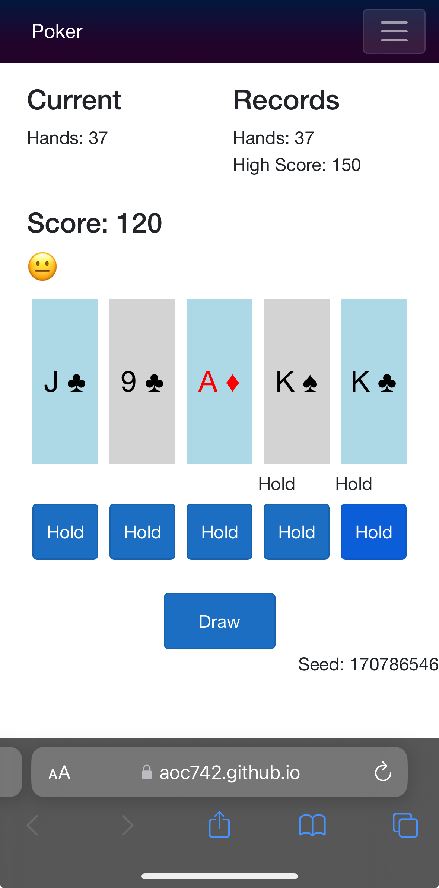

# About
This is a very simple Five Card Stud Poker game. 

# Play the game
[https://aoc742.github.io/poker/](https://aoc742.github.io/poker/)

## Background
This game is designed to bring you back to the year 2000 when you are riding in the card with nothing but your handheld Poker device. No cell phone. No internet.
I made this game because I miss the simple, minimalistic UI, offline, single player poker game that I could pick up and play for 5 seconds or 5 minutes. I hope to keep those roots in this game.

This game is written in C# using a Blazor app working as a Progressive Web App (PWA). It is statically hosted using Github Pages.

## Phone Screenshot 

